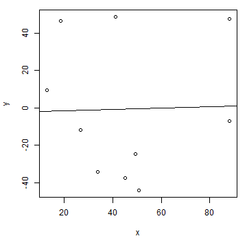

## Linear Regression Model

Consider $n$ data points $(x_1,y_1)$, $(x_2,y_2)$, ... , $(x_n,y_n)$. Linear regression aims to find a linear relationship $y=a x+b$ between $x$ and $y$ to minimize the square error sum
$$\sum_{i=1}^n (y_i-ax_i-b)^2.$$

The optimal values of $a$ and $b$ are given by
$$\hat{a}= \frac{ \sum_{i=1}^{n} (x_{i}-\bar{x})(y_{i}-\bar{y}) }{ \sum_{i=1}^{n} (x_{i}-\bar{x})^2},$$

$$\hat{b} = \bar{y} - \hat{a}\bar{x},$$

where $\bar{x}$ and $\bar{y}$ are sample means of $x$ and $y$, respectively.

---


## Shiny App: Using Linear Regression Model

The user indicates 

- the number of data points
- range of $x$-values
- range of $y$-values

This shiny app will

- randomly generate data points based on the user's setting
- fit the linear regression model of $y$ onto $x$
- calculate the sample means of $x$ and $y$
- draw the linear regression model

---

## Example

- In the shiny app, set the number of data point to be 10.

- The range of x-values is $[-50,50]$

- The range of y-values is $[0,100]$

The app will genere

- The sample means of $x$ and $y$ are

```R
> mean(x)
[1] 11.60971
> mean(y)
[1] 55.50811
```

---

## Example (cont'd)

From the shiny app, the figure of linear regression model is drawn as follows:


```r
x<-runif(10,-50,50)
y<-runif(10,0,100)
par(mar = c(5, 4, 1, 1))
plot(x~y,xlab="x",ylab="y")
abline(lm(x~y))
```

 
